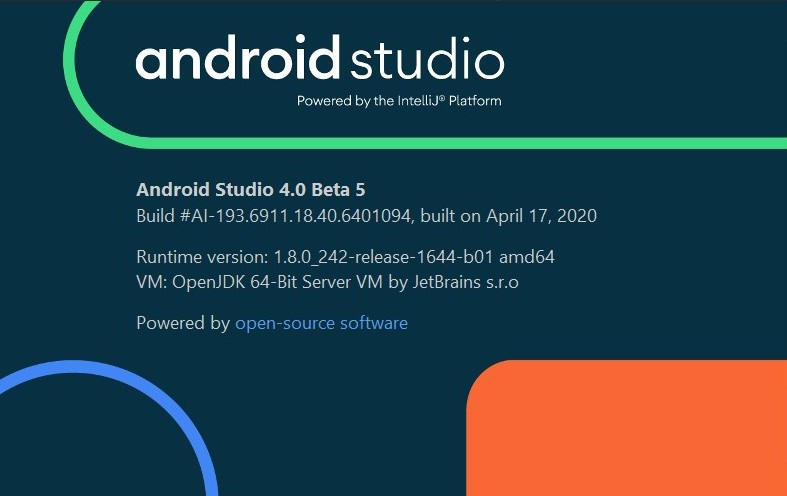

  

# 개발 언어
**C++** : 이미지 url 주소 파싱

**kotlin** : ui, thread 처리

# 환경

IDE : 

    android studio 4.0+
> build.grandle의 dependencies에 네이티브 라이브러리 사용으로 4.0 이상이 필요

SDK :

    NDK : 21.0.6113669
    CMake : 3.6.4
> build.grandle의 dependencies에 네이티브 라이브러리 사용으로 꼭 이 버전들이 필요 (최신 버전들이 호환되는지 테스트 필요)

# 빌드 방법
1. sync grandle 수행 (생략 가능)
> build.grandle에서 네이티브 라이브러리를 인터넷에서 자동으로 추가하고
> CMake가 이를 링크하는 형태임.
2. 빌드 또는 디버그 수행

# 추가 라이브러리
1. libcurl(c++)
1. ~~openssl(c++)~~
1. ~~jsoncpp(c++)~~